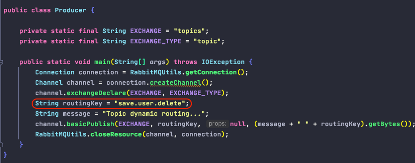

# RabbitMQ

1. Basic
        
        - RabbitMQ 消息传递稳定性高, 可靠性高
        - MQ 解耦了消息生产者和消息消费者
        - 支持AMQP协议(advanced message queuing protocol, an application layer protocol focusing on process-to-process communication across IP networks)
        - AMQP is a compact protocol(binary protocol), everything sent over AMQP is binary data
    
2. AMQ Model

3. Models

        1). Basic (Point-to-Point)
        

    
    
      2). Work Queue (Task Queue)
            - 默认使用round-robin轮询机制派发消息给不同的消费者
            - 可以手动设置按劳分配多劳多得机制, 以提高系统效率

    
      3). Publish/Subscribe (Fanout) 广播模型 (标准模型)
      

      
      
      4). Routing 
      

      5). Topics
      

4. Use Case
    
        1). 异步处理:
                eg: 用户注册后, 异步地发送注册成功邮件和注册成功短信(广播模型), 提高应用响应时间和吞吐量
        
        2). 应用解耦:
                eg: 用户购物结算后, 
                       之前: 订单系统会直接调用库存系统, 强耦合
                       之后: 订单系统发送一个消息给消息队列, 库存系统异步地消费消息队列中的消息
       
        3). 流量削峰:
                eg: 秒杀场景: 将消息队列置于用户请求和秒杀系统之间, 来控制活动人数, 超过一定阈值后直接丢弃订单, 可以缓解短时间的高流量压垮应用系统, 按自己的最大处理能力获取订单
                        
                
        
